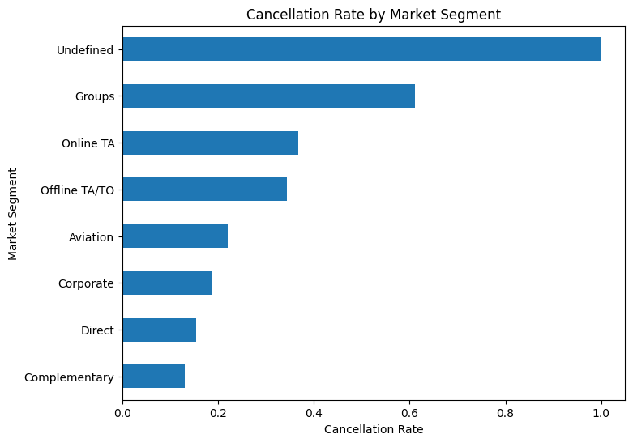

# Predicting Hotel Booking Cancellations: A Data-Driven Approach to Revenue Protection

**One-line hook:** Using machine learning to predict which hotel bookings are most likely to cancel, helping hotels better manage revenue and reduce last-minute losses.

---

## The Business Problem

Hotel cancellations create major uncertainty for revenue management. When guests cancel their reservations, hotels lose potential revenue and may struggle to fill empty rooms at the last minute. If hotels can identify bookings that are likely to cancel in advance, they can adjust overbooking strategies, send reminder emails, or offer incentives to reduce cancellations.

---

## The Data

This project analyzes a hotel booking dataset containing over 119,000 reservation records from two different hotels. The dataset includes information such as how far in advance guests booked, the market segment they belong to, the type of deposit required, and the average daily rate of the booking. These features help reveal patterns that influence whether a booking is eventually canceled.

---

## Key Discoveries

- **Long lead-time bookings cancel more often:** Guests who book far in advance are significantly more likely to cancel than those who book closer to their stay date.
- **Cancellation rates vary across market segments:** Some market segments show noticeably higher cancellation rates, suggesting that customer type strongly influences booking reliability.
- **Deposit policies influence behavior:** Bookings with certain deposit types tend to have lower cancellation rates, indicating that financial commitment affects guest decisions.
- **Pricing may affect cancellation risk:** Average daily rate (ADR) appears to have some relationship with cancellation patterns, suggesting that price sensitivity may play a role.

---

## Visualizing the Story

*This chart shows that cancellation rates vary significantly across different market segments, highlighting how customer type can strongly influence booking reliability.*

---

## Prediction Model

A **Gaussian Naive Bayes model** was trained to predict whether a hotel booking would be canceled. The model achieved approximately **72% accuracy** on the test dataset. In practical terms, this means the model can correctly identify a large portion of bookings that are likely to cancel, giving hotel managers an opportunity to take proactive actions before revenue is lost.

---

## Recommendations

1. **Monitor high lead-time bookings more closely:** Since bookings made far in advance show higher cancellation rates, hotels should track these reservations and send reminder communications as the stay date approaches.

2. **Adjust overbooking strategies using predictions:** By identifying bookings with higher cancellation probability, hotels can make smarter overbooking decisions and reduce the risk of empty rooms.

3. **Target high-risk segments with retention strategies:** Certain market segments show higher cancellation behavior, so targeted incentives or flexible rebooking options may help reduce cancellations.

---

## Tools & Techniques

Python | Pandas | Scikit-Learn | Matplotlib | Seaborn | Gaussian Naive Bayes | Google Colab

---

*This project was completed as part of ISOM 835: Predictive Analytics at Suffolk University's Sawyer Business School.*

